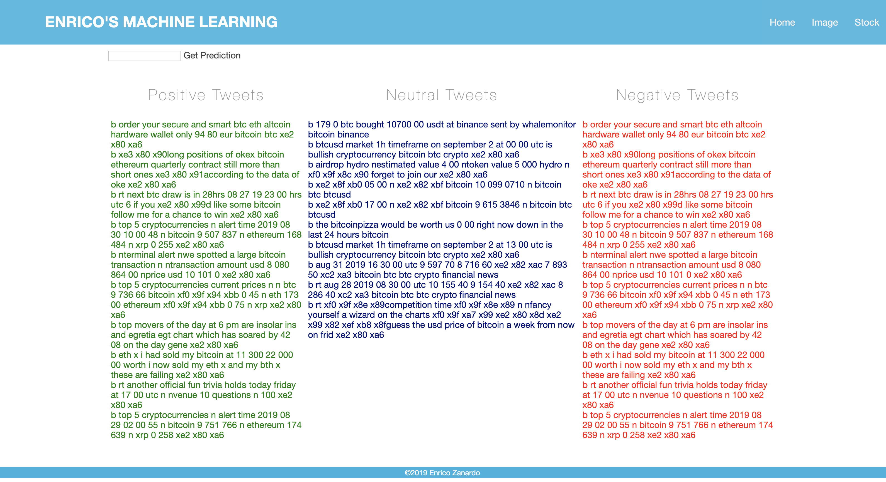
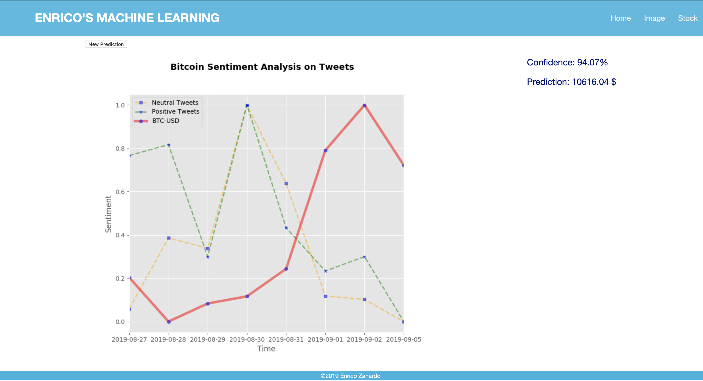

## Bitcoin Stock Prediction based on Tweeter Sentiment Analysis

This prototype will allow to make prediction on Bitcoin price based on the sentiment provided by the tweets written time by time.


Step 1:


Step2:


### To run the application:
- Create an application in the Twitter Development Account
- Create a .env 
- fill the following info the .env file:
```
# Tweeter developer settings
CONSUMER_KEY = "your consumer key"
CONSUMER_SECRET_KEY = "your consumer secret key"

ACCESS_TOKEN_KEY = "your accesss token key"
ACCESS_TOKEN_SECRET = "your access token secret"

TOPIC_NAME = "BTC"
```

This prototype is working with "static" tweets. That means that is not mandatory to have a
limited API application in tweeter to use the app ;)

- Install app dependencies:

```make install```


- Run the app
```python manage.py runserver```

- Go to Stock
